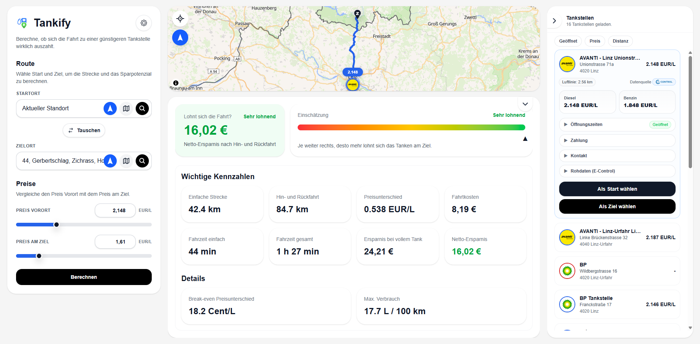

# 🚗 Tankify Frontend

A modern Next.js app that helps you decide whether it’s worth driving to a cheaper fuel station.



It calculates:

* ⛽ Fuel cost for the trip
* 💸 Savings compared to local fuel price
* 📍 Real driving distance (via routing)
* ⏱ Estimated travel time
* 📊 Profitability (visual indicator)

---

## ✨ Features

* 🗺 Interactive OpenStreetMap with Leaflet
* 📍 Select start & destination via:

    * Address search
    * Map click mode
* 🛣 Real road routing (OSRM)
* 📈 Profit indicator (red → yellow → green)
* 🎚 Sliders + manual input for:

    * Fuel prices
    * Consumption
    * Tank size
    * Average speed
* 🎯 Calculates:

    * Distance
    * Duration
    * Trip cost
    * Net savings
    * Break-even price difference
    * Max consumption

---

## 🛠 Tech Stack

* **Next.js (App Router) 16.2.1**
* **Node 10.9.3**
* **React 19.2.4**
* **TypeScript**
* **Tailwind CSS**
* **React Leaflet** (OpenStreetMap)
* **OSRM API** (routing)
* **Nominatim API** (geocoding)

---

## 🚀 Getting Started

### 1. Clone the repo

```bash
git clone https://github.com/RedMotionMedia/tankify-frontend.git
cd tankify-frontend
```

### 2. Install dependencies

```bash
npm install
```

### 3. Run development server

```bash
npm run dev
```

Open:

```bash
http://localhost:3000
```

---

## ⚙️ How It Works

### 1. Routing (distance + time)

Uses OSRM:

```
https://router.project-osrm.org
```

Returns:

* Distance (meters)
* Duration (seconds)
* Route geometry

---

### 2. Calculations

#### Trip fuel usage

```
tripLiters = (distance_roundtrip / 100) * consumption
```

#### Trip cost

```
tripCost = tripLiters * destinationPrice
```

#### Savings

```
grossSaving = tankSize * (localPrice - destinationPrice)
netSaving = grossSaving - tripCost
```

#### Break-even

```
breakEven = tripCost / tankSize
```

---

## 🎨 UI Logic

### Profit Indicator

| Range | Meaning            |
| ----- | ------------------ |
| < 0€  | Not worth it 🔴    |
| 0–5€  | Barely worth it 🟡 |
| 5–15€ | Worth it 🟢        |
| >15€  | Very worth it 🟢🔥 |

---

## ⚠️ Limitations

* Uses public APIs (rate limited)
* Routing is approximate (no live traffic)
* Fuel prices must be entered manually

---

## 🔮 Possible Improvements

* 🔌 Live fuel price integration
* 📍 Nearby fuel station suggestions
* 💾 Save favorite routes
* 🌙 Dark mode
* 📱 Mobile PWA version

---

## 📄 License

MIT License

---

## 🙌 Credits

* OpenStreetMap
* OSRM
* React Leaflet
* Overpass-API
* E-Control API

---

## 💡 Idea

Built to answer one simple question:

> “Is it actually worth driving for cheaper fuel?”

Now you know 😄
